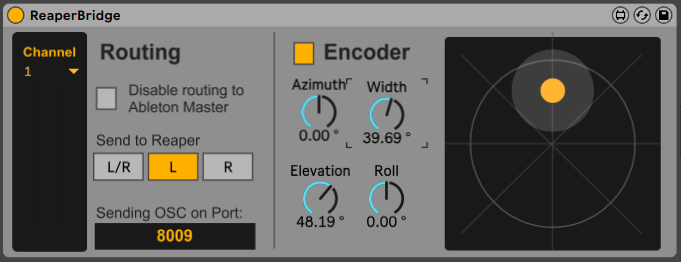
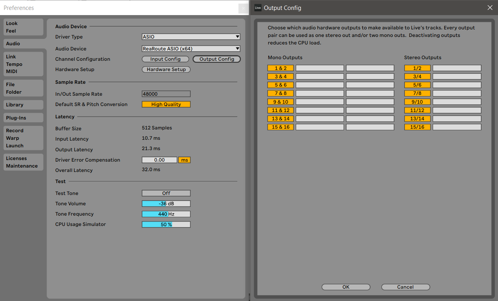
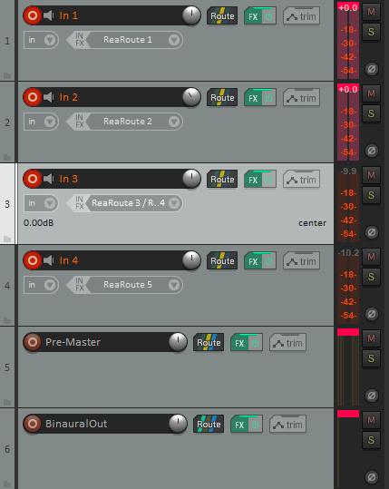

# ReaperBridge

A Max4Live-device for sending audio and positional data from Ableton to Reaper for Ambisonics usage.

## Background

As of version 12, Ableton Live itself does not support multichannel audio, meaning surround sound can only be achieved via Max4Live's additional routing capabilities (implemented in patches like Envelop4Live, Surround Panner). Reaper on the other hand offers built-in multichannel support, meaning it is able to natively make use of the Ambisonics format and *reap* the benefits of its vast customizability. Using an internal soundcard as the virtual cabling, ReaperBridge is able to route audio tracks  from Ableton directly into Reaper where the StereoEncoder from the IEM PlugIn-suite encodes it for Ambisonics usage. Furthermore, the positional parameters of the encoder can be directly controlled (and automated) from the ReaperBridge-interface inside Ableton, offering creative many creative 3-dimensional movement options thanks to Ableton's flexible parameter mapping capabilities.

## Setup

Before ReaperBridge can be used, 2 additional components need to be configured/installed:

### Internal soundcard

For sending audio from Ableton to Reaper, an internal soundcard needs to be configured as a virtual cable between the two applications. 

*Windows*

On Windows, Reaper's Rearoute driver is by *far* the most convenient option. If you are a wizard and/or masochist, JACK Audio Connection Kit may be used as well.

Setting up ReaRoute:
1. In Ableton, check whether ReaRoute ASIO (x64) is an option under your ASIO drivers. If yes, select it and skip to step 3.
2. Run the latest [Reaper](https://www.reaper.fm/download.php) installer. Configure as needed until the step "Choose components". Under "Optional functionality", make sure that "ReaRoute ASIO driver" is selected. Proceed with the installation and move back to step 1.
3. In Ableton, under Preferences -> Audio -> Output Config, enable all available mono- and stereo-outputs. By default, channels should go up to 16 on both sides.

*MacOS*

As of my knowledge, ReaRoute is not an option on MacOS. Third-party drivers like [Blackhole](https://github.com/ExistentialAudio/BlackHole/tree/master) or [Soundflower](https://github.com/mattingalls/Soundflower) may be used instead. As a windows-only user, I can not offer much advice in terms of configuring the driver itself. If you have 16 (or more) outputs from Ableton linked to 16 (or more) inputs in Reaper, you should be on the right track.
In Ableton under Preferences -> Audio, select Blackhole/Soundflower as an audio driver and make sure to enable all available mono- and stereo-outputs under "Output Config".

### IEM PlugIn-Suite

ReaperBridge has been designed to work with the IEM PlugIn-Suite as a means of translating mono/stereo signals into Ambisonics format.

Installation
1. Download the PlugIn bundle appropriate for your OS from [here](https://plugins.iem.at/download/).
2. Extract the folder, copy all files from the "VST" folder into the designated VST2 plugins folder on your machine.
3. If not already configured, add said folder to the Plug-Ins path list in Reaper under Options -> Preferences -> Plug-ins -> VST -> Edit path list -> Add path

## Ambisonics in Reaper

Ambisonics is too broad of a topic to cover in a README. Here is the most basic setup:
1. In Reaper add 3 tracks: "In 1", "Pre-Master" and "BinauralOut".
2. In the routing options of "In 1" and "Pre-Master": disable Master send, set track channels to 64. We're using 7th order ambisonics in this case.
3. Route "In 1" to "Pre-Master" with the "Multichannel Source" option set to "64 channels"
4. Repeat step 3 for "Pre-Master" to "BinauralOut".
5. Add the IEM StereoEncoder to "In 1", add the IEM BinauralDecoder to "BinauralOut" | Optional: Add the IEM EnergyVisualizer to "Pre-Master", 
6. For testing, add a Pink/White Noise Generator to "In 1" before the StereoEncoder. Tweak the azimuth and elevation setting in the StereoEncoder. If everything is configured correctly, the noise should now be spatialized.
7. Remove the noise generator.

## Usage

1. Drag the ReaperBridge.amxd onto a track in Ableton Live.
2. Select a unique channel. 1/2, 3/4, ... = Stereo | 1, 2, ... = Mono
3. Add a track in Reaper, configure routing akin to "In 1" from the "Ambisonics in Reaper" section, add the IEM StereoEncoder
4. Arm the track, change the input to "ReaRoute [channel selected in Ableton]" -> Audio played back in Ableton should now be received in Reaper
5. In ReaperBridge, look at the number beneath "Sending OSC on port", enter said number into the OSC Receiver in the IEM Stereo Encoder at the bottom left and click "Open"

All sounds played back on the configured track in Ableton are now treated as an Ambisonics object which can be controlled directly inside of Ableton. Multiple tracks in Ableton may be send to the same receiver in Reaper by choosing the same channel inside ReaperBridge. To create another object with different positional parameters, duplicate the track in both Ableton and Reaper and choose a unique Rearoute channel. The port inside the IEM StereoEncoder needs to be updated as well.

A simple demo session for using ReaperBridge can be found in the demo folder.